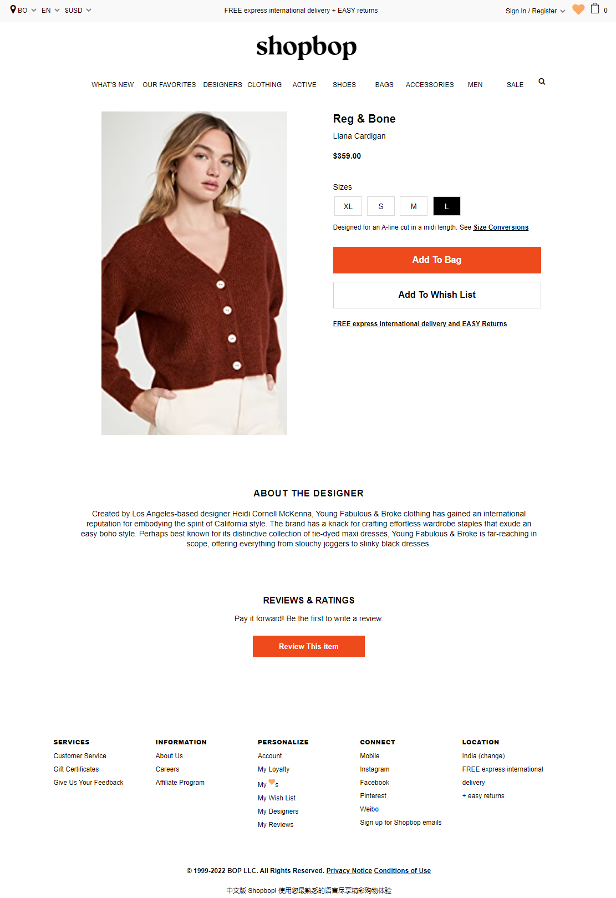

# Shopbop Clone

The YouTube clone offers users a different user interface with search functionality,
category selections, and many other features, and it's fully responsive to any device..

### Tech Stack

### `HTML` `CSS` `JavaScript` `React` `Material UI` `Rapid API`

 

### App Screenshots

## `Landing Page`

## `Products Details Page`

## `SignUp Page`

## `SignIn Page`

 

#### Demo

https://the-shopbop-clone.netlify.app/
